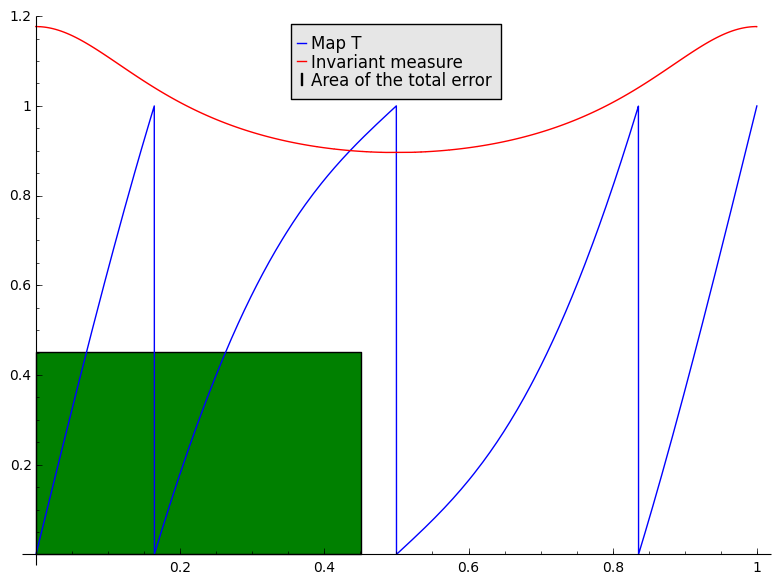
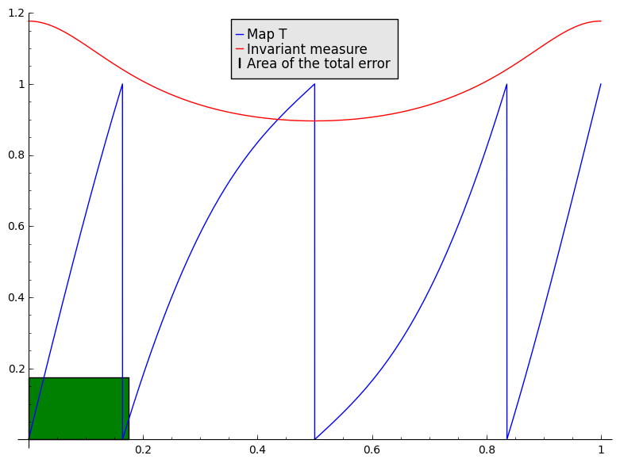

Overview and detailed example
=============================
	
.. highlights: Two examples are inside the files ``example.py`` and ``example2.py``, which you can run from within Sage with ``%runfile "example.py"``.

The typical workflow is the following: first, you create a partition, which is an increasing list (or another Python iterable type) of numbers, starting with 0 and ending with 1; e.g.::

	sage: partition = [0, 0.25, 0.5, 1]

The following command creates automatically a list of ``n`` intervals with the same width, which is usually better::

	sage: from partition import equispaced, step_function
	sage: partition = equispaced(1024)

Note that we need to import the functions that we will use from each Python file. We used ``equispaced`` here, and we will need ``step_function`` later. If you are lazy, you can use ``from partition import *``; this is considered bad practice in Python source files, but it is ok from a command line.
Then, you create a dynamic, that is, a function that represents the map you want to work with::

	sage: from dynamic import PerturbedFourxDynamic
	sage: D = PerturbedFourxDynamic(prec=53, c = 0.4)

We use here ``PerturbedFourxDynamic``, which represents the dynamic for the function :math:`T(x) = 4x + C\sin(2\pi x) \mod 1`, with :math:`C` a constant. You can check the source of this class as a starting point to create new dynamics. Basically, you'll need to inherit from ``Mod1Dynamic`` and define ``f_unquotiented``, ``fprime`` (its derivative), and if you wish to use the estimator also ``LasotaYorkeLambda`` and ``LasotaYorkeB``, which are the constants for the Lasota-Yorke inequality :math:`\operatorname{Var} Lf \leq \lambda\operatorname{Var} f + B\|f\|_1`.

The parameter ``prec`` is the number of binary digits of precision used in the computations. The default is normal double precision reals, ``prec=53``, which is enough for most needs.

We are now ready to create (*assemble*) the Ulam matrix::

	sage: from assembler import assemble
	sage: P = assemble(D, partition, epsilon=1e-10, prec=53, n_jobs=1)
	Checking partition (disable with check_partition=False)...done.
	Coercing partition to the needed precision...done.
	Assembling...done.
	Assembling...done.
	Assembling...done.
	Assembling...done.
	Summing matrices on the function branches...done.

There is some output to give you a hint of what is happening.

The parameter ``epsilon`` is the maximum allowed error, ``prec`` is as above, and ``n_jobs`` is the number of parallel processor cores to use for the assembly. For small matrices, ``n_jobs=1`` is faster.

The returned ``P`` is a sparse interval matrix (Sage data type). We can compute its Perron vector as follows::

	sage: from eigenerr import perron_vector, rigorous_residual, decay_time_L1_canonical
	sage: v = perron_vector(P)
	Computing Perron vector...done.

and then compute its norm-1 residual (that is, :math:`v-Pv`) with::

	sage: res = rigorous_residual(P, v)
	
The output ``res`` is an interval; to find its (rigorous) maximum value use ``res.magnitude()``.

The following command finds :math:`N` so that :math:`\|P^N\|_1 \leq \alpha`, which is a required ingredient of the estimate::

	sage: my_alpha=1/2
	sage: N = decay_time_L1_canonical(P, alpha=my_alpha)
	Computing decay time: iterating on each basis vector...
	[Parallel(n_jobs=1)]: Done   1 jobs elapsed: 0.0s
	[Parallel(n_jobs=1)]: Done  50 jobs       | elapsed:    0.1s
	[Parallel(n_jobs=1)]: Done 200 jobs       | elapsed:    0.6s
	[Parallel(n_jobs=1)]: Done 450 jobs       | elapsed:    1.3s
	[Parallel(n_jobs=1)]: Done 800 jobs       | elapsed:    2.4s
	[Parallel(n_jobs=1)]: Done 1023 out of 1023 | elapsed:    3.1s finished

Be careful because if you are in a pure-Python ``.py`` file rather than in the Sage prompt, then ``1/2`` will default to integer division and hence return 0. To change this behaviour to ``1/2 == 0.5``, use the mystic line ``from __future__ import division`` at the top of your file.

You can compute the resulting Lasota-Yorke-based estimate with::

	sage: from estimator import global_error, optimal_twogrid_decay_time
	sage: err = global_error(D, partition, N, my_alpha, res)
	Errors: discretization 0.596709, eigenvector residual 4.52168e-07

The total error ``err`` is the sum of the two printed components. Typically the second one will be small, since it depends on the accuracy of the eigenvector computation (which can be pretty accurate even for large matrices). The first one depends on the accuracy bound that we can prove for approximating the density function of the invariant measure with a step function subordinated to the given partition. This is typically quite poor because it relies on the Lasota-Yorke estimate. For the given function, the variance of the invariant measure is bounded by 43.65, which we have to multiply by :math:`\frac{N}{(1-\alpha)}` (14 in our case) and then divide by the width of the largest interval in the partition (1024 in our case). In any case I agree, an error of 0.6 on a density of norm 1 sucks, we need to do better.

What are the possible solutions? We can increase the partition size, but this also increases the amount of work that we have to do in the decay time estimate. The amount of required work grows as :math:`O(n^2)` for a partition of size :math:`n`, so this can get slow pretty quick.

The solution is relying on the two-grid error estimate. This allows to estimate the decay time for a larger partition size using the one from a smaller partition size. Let's take a finer partition of size 8192::

	sage: finePartition = 2**13

Note that ``**`` is the Python operator for exponentiation. Inside Sage (i.e., not in a ``.py`` file), ``2^13`` would work too. Also note that most functions that accept a partition also work if you give them a number; they run it through ``equispaced(n)`` automatically.

Reducing the error to :math:`alpha=\frac{1}{2}` isn't quite enough for our estimate. Fortunately, the error decays quite fast, so it isn't that much more expensive to shrink the norm to a much lower value::

	sage: alphaC = 1/256
	sage: NC = decay_time_L1_canonical(P, alpha=alphaC)
	Computing decay time: iterating on each basis vector...
	[Parallel(n_jobs=1)]: Done   1 jobs       | elapsed:    0.0s
	[Parallel(n_jobs=1)]: Done  50 jobs       | elapsed:    0.2s
	[Parallel(n_jobs=1)]: Done 200 jobs       | elapsed:    0.9s
	[Parallel(n_jobs=1)]: Done 450 jobs       | elapsed:    2.0s
	[Parallel(n_jobs=1)]: Done 800 jobs       | elapsed:    3.6s
	[Parallel(n_jobs=1)]: Done 1023 out of 1023 | elapsed:    4.5s finished

The decay time ``NC`` (C stands for *coarse* here) is 10.

Using this decay time on the coarse partition, we can estimate the decay time on the finer partition::

	sage: (NF, alphaF) = optimal_twogrid_decay_time(D, partition, finePartition, NC, alphaC)

This computation tells us that :math:`\|Q^{N_F}\|_1 \leq \alpha_F`, where :math:`Q` is the Ulam discretization on the finer grid (which we haven't computed yet). In our example, we get ``alphaF=0.3185`` and ``NF=26``. This estimate will not typically be tight, but it is enough for our computation, and it allows us to get a rigorous bound without running ``decay_time_L1_canonical`` on ``Q``, which would take 64 times as much as the one on ``P``.

Now all we have to do is assemble the larger matrix ``Q`` and compute its approximated Perron vector::

	sage: Q = assemble(D, finePartition)
	Coercing partition to the needed precision...done.
	Assembling...1024...2048...3072...4096...5120...6144...7168...done.
	Assembling...1024...2048...3072...4096...5120...6144...7168...done.
	Assembling...1024...2048...3072...4096...5120...6144...7168...done.
	Assembling...1024...2048...3072...4096...5120...6144...7168...done.
	Summing matrices on the function branches...done.
	sage: vF = perron_vector(Q)
	Computing Perron vector...done.
	sage: resF = rigorous_residual(Q, vF)

Again this residual is quite small, of the order of :math:`10^{-8}`. Type ``resF.magnitude()`` to see it. We now have everything we need for a better error estimate::

	sage: errF = global_error(D, finePartition, NF, alphaF, resF)
	Errors: discretization 0.203259, eigenvector residual 7.27922e-06

The error is now better. The following command shows a graph of the transfer function :math:`T(x)`, its invariant measure, and a square with area equal to the :math:`L^1` error bound that we have computed::

	sage: plot(lambda x: D.f(RIF(x)).center(), 0, 1, legend_label='Map T') + plot_step_function(step_function(vF, finePartition), color='red', legend_label='Invariant measure') + bar_chart([sqrt(errF)], width=sqrt(errF), color='green', legend_label='Area of the total error')

Still too large for your taste? You just need to increase the dimension of the fine partition to make it smaller. The assembly will take about 1-2 minutes (depending on the speed of your computer). The rest of the computation is reasonably fast::

	sage: finePartition = 2**16
	sage: Q = assemble(D, finePartition)
	Coercing partition to the needed precision...done.
	Assembling...1024...2048...3072...4096...5120...6144...7168...8192...9216...10240...11264...12288...13312...14336...15360...16384...17408...18432...19456...20480...21504...22528...23552...24576...25600...26624...27648...28672...29696...30720...31744...32768...33792...34816...35840...36864...37888...38912...39936...40960...41984...43008...44032...45056...46080...47104...48128...49152...50176...51200...52224...53248...54272...55296...56320...57344...58368...59392...60416...61440...62464...63488...64512...done.
	Assembling...1024...2048...3072...4096...5120...6144...7168...8192...9216...10240...11264...12288...13312...14336...15360...16384...17408...18432...19456...20480...21504...22528...23552...24576...25600...26624...27648...28672...29696...30720...31744...32768...33792...34816...35840...36864...37888...38912...39936...40960...41984...43008...44032...45056...46080...47104...48128...49152...50176...51200...52224...53248...54272...55296...56320...57344...58368...59392...60416...61440...62464...63488...64512...done.
	Assembling...1024...2048...3072...4096...5120...6144...7168...8192...9216...10240...11264...12288...13312...14336...15360...16384...17408...18432...19456...20480...21504...22528...23552...24576...25600...26624...27648...28672...29696...30720...31744...32768...33792...34816...35840...36864...37888...38912...39936...40960...41984...43008...44032...45056...46080...47104...48128...49152...50176...51200...52224...53248...54272...55296...56320...57344...58368...59392...60416...61440...62464...63488...64512...done.
	Assembling...1024...2048...3072...4096...5120...6144...7168...8192...9216...10240...11264...12288...13312...14336...15360...16384...17408...18432...19456...20480...21504...22528...23552...24576...25600...26624...27648...28672...29696...30720...31744...32768...33792...34816...35840...36864...37888...38912...39936...40960...41984...43008...44032...45056...46080...47104...48128...49152...50176...51200...52224...53248...54272...55296...56320...57344...58368...59392...60416...61440...62464...63488...64512...done.
	Summing matrices on the function branches...done.
	sage: vF = perron_vector(Q)
	Computing Perron vector...done.
	sage: (NF, alphaF) = optimal_twogrid_decay_time(D, partition, finePartition, NC, alphaC)
	sage: resF = rigorous_residual(Q, vF)
	sage: errF = global_error(D, finePartition, NF, alphaF, resF)
	Errors: discretization 0.0305556, eigenvector residual 6.04361e-05

Now the error is a much more acceptable 0.03. The green rectangle looks much less impressive on the new plot::

	sage: plot(lambda x: D.f(RIF(x)).center(), 0, 1, legend_label='Map T') + plot_step_function(step_function(vF, finePartition), color='red', legend_label='Invariant measure') + bar_chart([sqrt(errF)], width=sqrt(errF), color='green', legend_label='Area of the total error')

This invariant measure is almost identical to the previous one. This is because the rigorous error that we can prove is much lower than the actual error. One of the culprits is the Lasota-Yorke inequality, which gives us only a poor estimate of the variance: this graph resembles closely the actualinvariant measure, which is quite smooth, and its variance is much less than 43.65 that we get from the LY bound. Another problem is that our estimate of the decay time :math:`N_F` is just an estimate; for instance, for the matrix :math:`Q` with partition size 8192 (and :math:`\alpha_F=0.3185`) we estimated :math:`N_F \leq 26`, but its real value is 7. The estimated :math:`N_F` grows with rate :math:`\lambda`, which should be the exact rate for piecewise expanding function, so the estimate is asymptoticaly tight. This is something at least.

